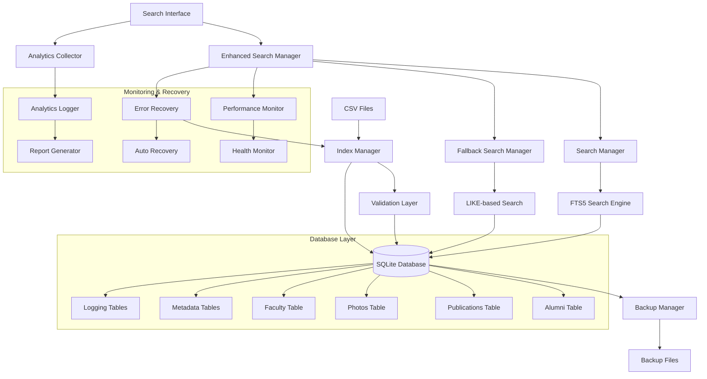
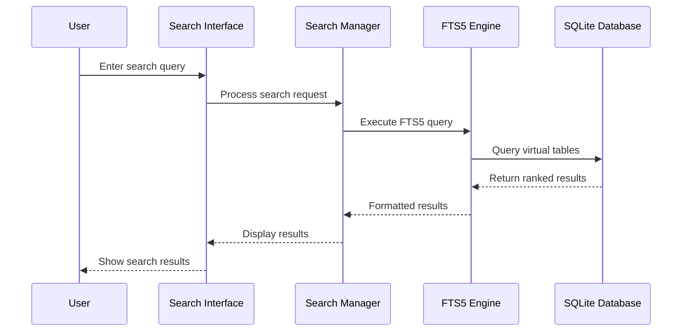
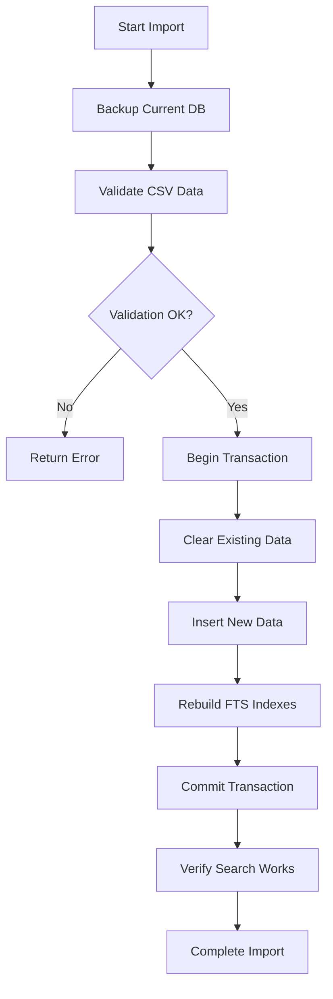

# Design Document

## Overview

The SQLite FTS5 search system provides a comprehensive, production-ready offline search solution for the law school kiosk application. The design centers around a resilient SQLite database with Full-Text Search capabilities, advanced error recovery, performance optimization, and accessibility features. The system enables instant search across alumni, publications, photos, and faculty data while maintaining high availability through automated fallback mechanisms, comprehensive monitoring, and intelligent caching strategies.

## Architecture

### High-Level Architecture



### Database Architecture

The system uses a single SQLite database file (`kiosk.db`) with four main tables, each enhanced with FTS5 virtual tables for search functionality:

1. **Core Tables**: Store structured data with relationships
2. **FTS5 Virtual Tables**: Provide full-text search indexes
3. **Metadata Tables**: Track import history and system state

### Search Flow Architecture



## Components and Interfaces

### 1. Enhanced Search Manager Component

**Purpose**: Orchestrates search operations with error recovery, performance monitoring, and fallback mechanisms

**Key Methods**:
- `searchAll(query: string, filters?: SearchFilters, options?: SearchOptions): Promise<SearchResult[]>`
- `getSearchSuggestions(query: string, limit?: number): Promise<string[]>`
- `getFuzzyMatches(query: string, threshold?: number): Promise<SearchResult[]>`
- `getRecoveryStatus(): RecoveryStatus`
- `rebuildIndexes(): Promise<void>`

**Enhanced Interfaces**:
```typescript
interface SearchFilters {
  yearRange?: YearRange;
  publicationType?: string;
  department?: string;
  decade?: string;
  fuzzyMatch?: boolean;
  stemming?: boolean;
}

interface SearchOptions {
  limit?: number;
  offset?: number;
  timeout?: number;
  enableFallback?: boolean;
  cacheResults?: boolean;
  trackAnalytics?: boolean;
}

interface SearchResult {
  id: string;
  type: 'alumni' | 'publication' | 'photo' | 'faculty';
  title: string;
  subtitle?: string;
  thumbnailPath?: string;
  relevanceScore: number;
  matchType: 'exact' | 'fuzzy' | 'stemmed' | 'fallback';
  highlightTerms?: string[];
  metadata?: Record<string, any>;
}

interface RecoveryStatus {
  hasError: boolean;
  errorType?: string;
  canRecover: boolean;
  recoveryActions: string[];
  isRecovering: boolean;
  lastRecoveryTime?: Date;
}
```

### 2. Fallback Search Manager Component

**Purpose**: Provides LIKE-based search when FTS5 fails, ensuring system reliability

**Key Methods**:
- `searchAll(query: string, options?: FallbackOptions): Promise<SearchResult[]>`
- `searchByType(query: string, type: string, options?: FallbackOptions): Promise<SearchResult[]>`
- `isAvailable(): boolean`

**Fallback Strategy**:
```typescript
interface FallbackOptions {
  limit?: number;
  offset?: number;
  caseSensitive?: boolean;
  exactMatch?: boolean;
  wordBoundary?: boolean;
}

class FallbackSearchManager {
  // Implements LIKE-based queries as backup
  // Provides basic text matching when FTS5 unavailable
  // Maintains consistent result format with main search
}
```

### 3. Performance Monitor Component

**Purpose**: Tracks system performance, detects issues, and triggers optimizations

**Key Methods**:
- `trackQuery(query: string, duration: number, resultCount: number): void`
- `getPerformanceMetrics(): PerformanceMetrics`
- `detectPerformanceIssues(): PerformanceIssue[]`
- `optimizeQueries(): Promise<void>`

**Performance Interfaces**:
```typescript
interface PerformanceMetrics {
  averageQueryTime: number;
  slowQueries: QueryMetric[];
  cacheHitRate: number;
  memoryUsage: number;
  databaseSize: number;
  indexHealth: IndexHealthStatus[];
}

interface QueryMetric {
  query: string;
  duration: number;
  timestamp: Date;
  resultCount: number;
  cacheHit: boolean;
}

interface PerformanceIssue {
  type: 'SLOW_QUERY' | 'HIGH_MEMORY' | 'INDEX_FRAGMENTATION' | 'CACHE_MISS';
  severity: 'LOW' | 'MEDIUM' | 'HIGH' | 'CRITICAL';
  description: string;
  suggestedAction: string;
  autoFixAvailable: boolean;
}
```

### 2. Database Manager Component

**Purpose**: Handles SQLite database operations and FTS5 management

**Key Methods**:
- `initializeDatabase(): Promise<void>`
- `createFTSIndexes(): Promise<void>`
- `executeSearch(query: string, table: string): Promise<any[]>`
- `rebuildIndexes(): Promise<void>`

**Database Schema**:
```sql
-- Alumni Table
CREATE TABLE alumni (
  id INTEGER PRIMARY KEY,
  full_name TEXT NOT NULL,
  class_year INTEGER,
  role TEXT,
  composite_image_path TEXT,
  portrait_path TEXT,
  caption TEXT,
  tags TEXT,
  sort_key TEXT
);

-- Alumni FTS5 Virtual Table
CREATE VIRTUAL TABLE alumni_fts USING fts5(
  full_name, caption, tags, role,
  content='alumni',
  content_rowid='id'
);
```

### 3. Import Manager Component

**Purpose**: Handles CSV data import and database updates

**Key Methods**:
- `importFromCSV(filePath: string, tableType: TableType): Promise<ImportResult>`
- `validateCSVData(data: any[]): ValidationResult`
- `backupDatabase(): Promise<string>`
- `updateFTSIndexes(): Promise<void>`

**Import Process Flow**:


### 4. Enhanced Search Interface Component

**Purpose**: Provides accessible, touch-friendly search functionality with advanced features

**Key Features**:
- Real-time search with intelligent debouncing (300ms delay)
- Accessibility compliance (WCAG 2.1 AA)
- Touch-optimized interface (44px minimum targets)
- Advanced filter controls with visual feedback
- Error boundaries with graceful degradation
- Analytics tracking and usage monitoring

**Enhanced React Component Structure**:
```typescript
interface SearchInterfaceProps {
  onResultSelect: (result: SearchResult) => void;
  initialFilters?: SearchFilters;
  placeholder?: string;
  className?: string;
  showFilters?: boolean;
  showSuggestions?: boolean;
  maxResults?: number;
  debounceMs?: number;
  accessibilityMode?: 'standard' | 'high-contrast' | 'large-text';
  touchOptimized?: boolean;
  enableAnalytics?: boolean;
}

interface SearchInterfaceState {
  query: string;
  filters: SearchFilters;
  results: SearchResult[];
  suggestions: string[];
  isLoading: boolean;
  error: SearchError | null;
  performanceMetrics: QueryMetric | null;
}

const SearchInterface: React.FC<SearchInterfaceProps> = (props) => {
  // Enhanced implementation with error boundaries
  // Accessibility features and touch optimization
  // Performance monitoring and analytics
};
```

### 5. Analytics and Logging Component

**Purpose**: Tracks usage patterns, performance metrics, and system health

**Key Methods**:
- `trackSearch(query: string, filters: SearchFilters, results: SearchResult[]): void`
- `trackResultClick(result: SearchResult, position: number): void`
- `trackError(error: SearchError, context: string): void`
- `generateUsageReport(period: DateRange): UsageReport`

**Analytics Interfaces**:
```typescript
interface UsageReport {
  period: DateRange;
  totalSearches: number;
  uniqueQueries: number;
  popularTerms: TermFrequency[];
  noResultQueries: string[];
  averageResponseTime: number;
  errorRate: number;
  userEngagement: EngagementMetrics;
}

interface TermFrequency {
  term: string;
  count: number;
  resultCount: number;
  clickThroughRate: number;
}

interface EngagementMetrics {
  averageResultsViewed: number;
  clickThroughRate: number;
  sessionDuration: number;
  bounceRate: number;
}
```

### 6. Error Recovery and Health Monitoring

**Purpose**: Ensures system reliability through proactive monitoring and automated recovery

**Key Components**:
- **Health Monitor**: Continuous system health assessment
- **Auto Recovery**: Automated error detection and resolution
- **Index Manager**: FTS5 index maintenance and rebuilding
- **Connection Pool**: Database connection management with retry logic

**Recovery Strategies**:
```typescript
interface RecoveryStrategy {
  errorType: SearchErrorType;
  priority: number;
  autoExecute: boolean;
  execute(): Promise<RecoveryResult>;
  rollback(): Promise<void>;
}

class ErrorRecoverySystem {
  strategies: Map<SearchErrorType, RecoveryStrategy[]>;
  
  async handleError(error: SearchError): Promise<RecoveryResult> {
    // Classify error type
    // Select appropriate recovery strategy
    // Execute recovery with rollback capability
    // Log recovery actions and results
  }
}
```

## Data Models

### Alumni Data Model
```typescript
interface AlumniRecord {
  id: number;
  fullName: string;
  classYear: number;
  role: string;
  compositeImagePath?: string;
  portraitPath?: string;
  caption?: string;
  tags: string[];
  sortKey: string;
}
```

### Publications Data Model
```typescript
interface PublicationRecord {
  id: number;
  title: string;
  pubName: 'Amicus' | 'Legal Eye' | 'Law Review' | 'Directory';
  issueDate: Date;
  volumeIssue: string;
  pdfPath: string;
  thumbPath?: string;
  description: string;
  tags: string[];
}
```

### Photos Data Model
```typescript
interface PhotoRecord {
  id: number;
  collection: string;
  title: string;
  yearOrDecade: string;
  imagePath: string;
  caption: string;
  tags: string[];
}
```

### Faculty Data Model
```typescript
interface FacultyRecord {
  id: number;
  fullName: string;
  title: string;
  department: string;
  email?: string;
  phone?: string;
  headshotPath?: string;
}
```

## Error Handling and Recovery

### Comprehensive Error Handling Strategy

1. **Multi-Layer Error Detection**: Proactive monitoring at database, search, and UI layers
2. **Automated Recovery**: Self-healing system with multiple fallback strategies
3. **Graceful Degradation**: Maintain functionality even during partial system failures
4. **User-Friendly Messaging**: Clear, actionable error messages for end users

### Enhanced Error Recovery System

```typescript
enum SearchErrorType {
  FTS5_ERROR = 'FTS5_ERROR',
  INDEX_CORRUPT = 'INDEX_CORRUPT',
  CONNECTION_ERROR = 'CONNECTION_ERROR',
  TIMEOUT = 'TIMEOUT',
  MEMORY_ERROR = 'MEMORY_ERROR',
  VALIDATION_ERROR = 'VALIDATION_ERROR',
  SECURITY_ERROR = 'SECURITY_ERROR'
}

class EnhancedErrorRecovery {
  private recoveryStrategies: Map<SearchErrorType, RecoveryStrategy[]>;
  private healthMonitor: HealthMonitor;
  private fallbackManager: FallbackSearchManager;
  
  async handleError(error: SearchError, context: ErrorContext): Promise<RecoveryResult> {
    // 1. Classify and log error
    const classification = this.classifyError(error);
    await this.logError(error, classification, context);
    
    // 2. Select recovery strategy
    const strategies = this.getRecoveryStrategies(classification.type);
    
    // 3. Execute recovery with monitoring
    for (const strategy of strategies) {
      try {
        const result = await this.executeRecovery(strategy, error, context);
        if (result.success) {
          await this.logRecoverySuccess(strategy, result);
          return result;
        }
      } catch (recoveryError) {
        await this.logRecoveryFailure(strategy, recoveryError);
      }
    }
    
    // 4. Final fallback
    return await this.executeFinalFallback(error, context);
  }
  
  private async executeRecovery(
    strategy: RecoveryStrategy, 
    error: SearchError, 
    context: ErrorContext
  ): Promise<RecoveryResult> {
    const startTime = Date.now();
    
    try {
      // Pre-recovery validation
      await strategy.validate(error, context);
      
      // Execute recovery action
      const result = await strategy.execute(error, context);
      
      // Post-recovery verification
      await strategy.verify(result);
      
      return {
        success: true,
        strategy: strategy.name,
        duration: Date.now() - startTime,
        result: result.data
      };
    } catch (strategyError) {
      // Attempt rollback if available
      if (strategy.rollback) {
        await strategy.rollback();
      }
      
      throw strategyError;
    }
  }
}
```

### Recovery Strategies by Error Type

**FTS5 Engine Errors**:
1. Query sanitization and retry
2. Index integrity check and repair
3. Fallback to LIKE-based search
4. Full index rebuild (background)

**Database Connection Errors**:
1. Connection retry with exponential backoff
2. Connection pool reset
3. Database file integrity check
4. Emergency read-only mode

**Performance Issues**:
1. Query optimization and simplification
2. Result limit reduction
3. Cache utilization
4. Background maintenance scheduling

**Memory Errors**:
1. Garbage collection trigger
2. Cache cleanup
3. Result streaming
4. Process restart (if critical)

### Import Error Handling Enhancements

```typescript
class EnhancedImportManager {
  async importCSV(file: File, type: DataType): Promise<ImportResult> {
    const transaction = await this.db.beginTransaction();
    
    try {
      // 1. Pre-import validation
      const validation = await this.validateCSV(file, type);
      if (!validation.isValid) {
        return this.createValidationErrorResult(validation.errors);
      }
      
      // 2. Security scanning
      await this.scanForSecurityThreats(file);
      
      // 3. Backup current data
      const backupPath = await this.createBackup();
      
      // 4. Import with progress tracking
      const importResult = await this.performImport(file, type, transaction);
      
      // 5. Post-import verification
      await this.verifyImportIntegrity(importResult);
      
      // 6. Rebuild search indexes
      await this.rebuildSearchIndexes();
      
      await transaction.commit();
      
      return {
        success: true,
        recordsImported: importResult.count,
        backupPath,
        duration: importResult.duration
      };
      
    } catch (error) {
      await transaction.rollback();
      await this.restoreFromBackup(backupPath);
      
      throw new ImportError('Import failed with rollback', {
        originalError: error,
        backupRestored: true,
        dataIntegrityMaintained: true
      });
    }
  }
}
```

## Testing Strategy

### Unit Testing Approach

1. **Search Manager Tests**:
   - Query parsing and sanitization
   - Result ranking and sorting
   - Filter application logic
   - Performance benchmarks

2. **Database Manager Tests**:
   - FTS5 query generation
   - Index creation and maintenance
   - Transaction handling
   - Error recovery procedures

3. **Import Manager Tests**:
   - CSV parsing accuracy
   - Data validation rules
   - Backup and restore procedures
   - Rollback functionality

### Integration Testing

1. **End-to-End Search Flows**:
   - Search across all data types
   - Filter combinations
   - Real-time search behavior
   - Performance under load

2. **Data Import Workflows**:
   - Complete CSV import process
   - Database migration scenarios
   - Backup and recovery procedures
   - Index rebuild operations

### Performance Testing

**Target Metrics**:
- Simple search queries: < 50ms response time
- Complex multi-field queries: < 100ms response time
- Database size: < 50MB for full dataset
- Memory usage: < 100MB total
- Import time: < 5 minutes for complete dataset

**Load Testing Scenarios**:
- Rapid successive searches (typing simulation)
- Large result set handling (1000+ results)
- Concurrent search operations
- Memory leak detection over extended use

### Accessibility Testing

- Screen reader compatibility for search interface
- Keyboard navigation for all search functions
- High contrast mode support
- Touch target size validation (44px minimum)
- Text size scalability testing

## Performance Optimizations

### Database Optimizations

1. **FTS5 Configuration**:
   ```sql
   CREATE VIRTUAL TABLE alumni_fts USING fts5(
     full_name, caption, tags, role,
     content='alumni',
     content_rowid='id',
     tokenize='porter unicode61'
   );
   ```

2. **Index Strategy**:
   - Composite indexes on frequently filtered columns
   - Partial indexes for common query patterns
   - Regular ANALYZE operations for query optimization

3. **Query Optimization**:
   - Prepared statements for common queries
   - Result limiting with OFFSET/LIMIT
   - Efficient JOIN operations with proper indexing

### Application-Level Optimizations

1. **Search Debouncing**: 300ms delay to reduce query frequency
2. **Result Caching**: Cache recent search results in memory
3. **Lazy Loading**: Load thumbnails and details on demand
4. **Virtual Scrolling**: Handle large result sets efficiently

### Memory Management

- Connection pooling for database access
- Automatic cleanup of cached results
- Efficient image loading and disposal
- Background garbage collection monitoring

## Security and Data Protection

### Enhanced Input Sanitization
- Multi-layer input validation with whitelist and blacklist filtering
- Advanced FTS5 query sanitization preventing injection attacks
- Rate limiting to prevent abuse and DoS attacks
- Content Security Policy (CSP) implementation for web components

### Comprehensive Data Protection
- Encrypted backup files with key management
- File integrity verification using checksums
- Secure temporary file handling with automatic cleanup
- Audit trail for all data modifications with tamper detection

### Advanced System Security
```typescript
class SecurityManager {
  // Input validation and sanitization
  sanitizeSearchQuery(query: string): string {
    // Remove dangerous characters
    // Validate query length and complexity
    // Apply rate limiting
    // Log suspicious patterns
  }
  
  // File upload security
  validateUploadedFile(file: File): SecurityValidation {
    // Check file type and size
    // Scan for malicious content
    // Verify file integrity
    // Quarantine suspicious files
  }
  
  // Access control and monitoring
  checkAccess(operation: string, context: SecurityContext): boolean {
    // Validate operation permissions
    // Check rate limits
    // Log access attempts
    // Trigger alerts for violations
  }
}
```

### Security Monitoring and Alerting
- Real-time threat detection and response
- Automated security event logging
- Intrusion detection for file system access
- Security health monitoring and reporting

## Deployment Strategy

### Initial Deployment

1. **Database Setup**:
   - Create initial database schema
   - Import existing CSV data
   - Build FTS5 indexes
   - Verify search functionality

2. **Application Integration**:
   - Install SQLite dependencies
   - Configure database connection
   - Integrate search components
   - Test on target hardware

3. **Data Migration**:
   - Export existing data to CSV format
   - Validate data integrity
   - Perform initial import
   - Create baseline backup

### Maintenance Procedures

**Annual Updates**:
1. Emily updates CSV files
2. Run automated import script
3. Verify search functionality
4. Create backup of updated database
5. Deploy to kiosk system

**Monitoring and Health Checks**:
- Database file size monitoring
- Search performance metrics
- Index integrity verification
- Backup validation procedures